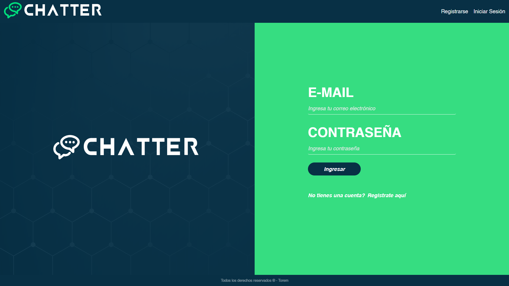
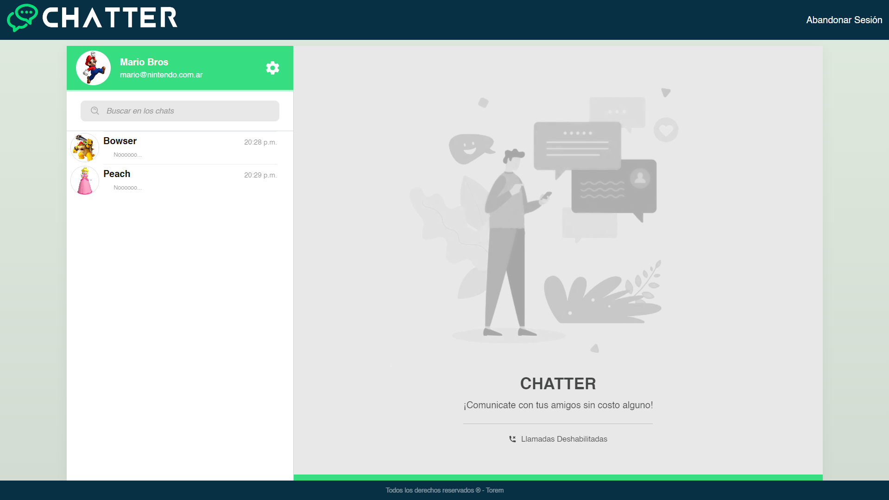
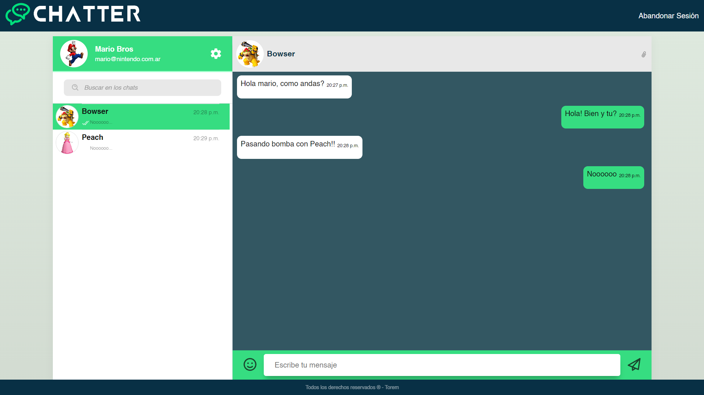

# Chatter App

Chatter es una app de mensajes, muy parecida a WhatsApp u otras aplicaciones de mensajería. Dentro de ella, existen usuarios capaces de ser registrados, iniciar sesión y a su vez mandar mensajes a distintas personas.

El objetivo es construir por encima de un maquetado establecido y conectar el cliente con una API REST. La API se puede acceder al mismo repositorio: [chatter_api](/chatter-api-main/)

Para correrla, basta con abrir una nueva terminal en la carpeta y escribir el comando `npm start`. Este comando levantará la aplicación en el puerto local 8080 y se le puede consultar mediante la URL: http://localhost:8080.

La api se puede consumir desde el front en este mismo repositorio: [chatter_frontend](/chatter-frontend-main/)

Todas las instrucciones para el uso de los endpoints, sockets y respuestas a las consultas http se encuentran en los archivos `README.md`

## Images App

